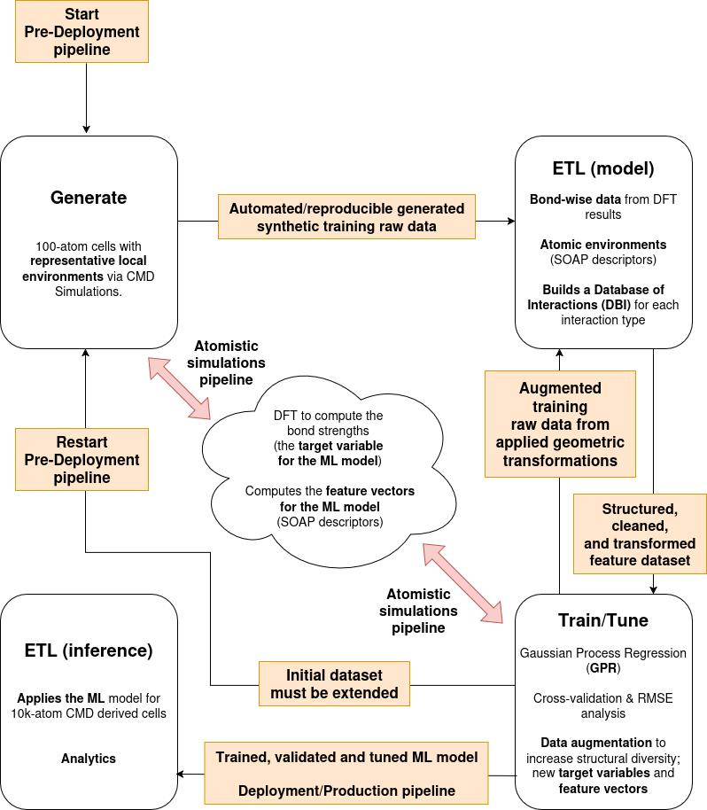

# PRM_4_113603

Below is an illustration of the MLOps workflow in terms of the Generate+ETL (GETL) framework used in Phys. Rev. Materials 4, 113603 (DOI: https://doi.org/10.1103/PhysRevMaterials.4.113603):

The folder structures of the two directories **ML** and **SS-ML** are the same as those used in the original Python/Shell-based GETL pipelines depicted in the figure above. Below a description of all directories in the root of this repository:

- **ML**: this directory contains all Python scripts that make up the **pre-Deployment** pipeline, which consists of the following steps:
  
  1. **Generate**: this is the key data acquisition step. It is optional in regular MLOps workflows where raw data already exists and is simply collected. In the case of the research work described here, the raw ifnormation of the materials under study (structures and bond data) were generated from scratch using physics-based models. The corresponding simulations are automated and reproducible, where Classical Molecular Dynamics (CMD) simulations are used to generate ensembles of 100-atom cells that are statistically equivalent (in terms of local environments) to the actual structures of the materials studied. The atomistic structure in these 100-atom cells resulting from these CMD simulations are used for the generation of the following synthetic training data:
     
     - the **bond strengths between pairs of atoms** using the Crystal Orbital Hamilton Population (COHP) method via electronic structure calculations within the Density Functional Theory (DFT) framework. An integrated COHP curve yields a value (labeled as -ICOHP) that represents the target variable for the Machine Learning (ML) model (i.e., bond strength).
       
     - the **atomic-centered feature vectors** for the ML model using the Smooth Overlap of Atomic Positions (SOAP) descriptors.
       
  2. **Extract**: Bond pairs, –ICOHP values ... Derive –ICOHP values, compute SOAP descriptors ... Raw data is parsed from files/databases/simulations. ... Feature extraction ... Structured feature engineering from raw inputs, part of a reproducible data process ...
     
  3. **Transform**: SOAP features, normalize, etc. ... Data is cleaned, featurized (e.g., SOAP), scaled, etc. ...
     
  4. **Load**: Build a Data Base of Interactions (DBI) for each interaction type ... Transformed data is saved or passed to the next stage (e.g., model) ...
     
  5. **Train**: GPR model using DBI ... Modeling The actual model is trained on the prepared features ... Train Gaussian Process Regression (GPR) with hyperparameter tuning ... Model development and training ...
      
  6. **Tune**: RMSEs, tune hyperparams, data augmentation ... Cross-validation & RMSE analysis: Evaluated prediction accuracy and determined optimal training sizes (~600 interactions per type). ... Data augmentation: Applied geometric transformations (shear, tension, compression) to generate more structural diversity and improve ML generalization. ... Includes experimentation, validation, and tuning ... 

- **SS-ML**: this directory contains all Python scripts that make up the **Deployment/Production** pipeline for the ML model ...  inference and analysis ... Apply trained ML model to large CMD structures and analyze mechanical behavior and bond exchange ... Model deployment & inference ... Batch inference on large-scale data, output analysis, and visualization ... 

- **data_examples**: The folder structure under its directory subfolders (**G**, **ETL_model**, **TT**, and **ETL_inference**) is the same as that used in the original Python/Shell-based GETL pipelines depicted in the figure above. The files and directories (folders) are organized as **big-data-full/<CHEM_COMPOSITION>/c/md/lammps/100/<ID_RUN>/\<STEP>/<SUB_STEP>** with:

  - **<CHEM_COMPOSITION>**: is the the nominal composition of the metallic glass under study, for instance Zr₄₉Cu₄₉Al₂.
 
  - **<ID_RUN>**: is a run of the CMD simulation described in the **Generate** step above.
 
  - **\<STEP>**: in that work, only the atomic structure in the last step of the CMD simulation described in the **Generate** step above is being used as a reference for the generation of SOAP descriptors and -ICOHP values; therefore, in the work **\<STEP>** was fixed to **2000**.
 
  - **<SUB_STEP>**: the data augmentation process described in the **Tune** step above consists of applying geometric transformations to the reference atomic structure resulted from the CMD simulation described in the **Generate** step. In the work, for all **<ID_RUN>s**, **<SUB_STEP>** is fixed to **0** for that reference atomic structure and ranges from **1** to **14** (also fixed) to compose the augmented data (atomic structures unfolded from that reference).

- **shell_scripts**: this directory contains all Shell scripts used to execute the Python scripts and third-part software (LAMMPS, Quantum ESPRESSO, LOBSTER, and quippy) in the directories above, in both local and remote HPC environments (represented by the cloud in the figure above).

- **img**: some images for the README files.
