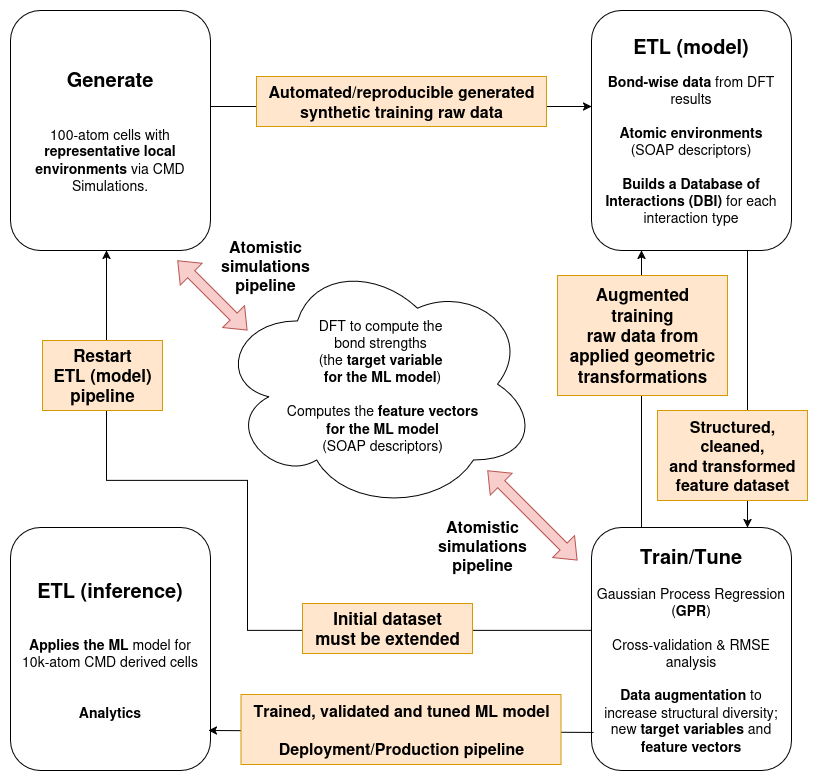

# PRM_4_113603 :: scripts

Below is an illustration of the MLOps workflow in terms of the Generate+ETL (GETL) framework used in **Phys. Rev. Materials 4, 113603** (DOI: https://doi.org/10.1103/PhysRevMaterials.4.113603; or the [preprint](https://www.researchgate.net/publication/345634787_Chemical_bonding_in_metallic_glasses_from_machine_learning_and_crystal_orbital_Hamilton_population)):

Below a description of the directories in this **scripts** folder in the order they are used in the MLOps workflow depicted in the diagram above:

## Generate (DataOps phase)

... each **<ID_RUN>** is an independent simulation that generates ... 

- **G/ML/big-data-full/zca-bd-full-SD-cpu.sh**: this script has no input files and it creates the run (**<ID_RUN>**) directories, which for the example nominal composition Zr₄₉Cu₄₉Al₂ is **Zr45Cu45Al10/c/md/lammps/100/<ID_RUN>**. For each **<ID_RUN>**, the script also creates the input file for the classical molecular dynamics (CMD) simulation using LAMMPS and then runs that CMD simulation; whose outputs will be written to that same **<ID_RUN>** directory. The full set of files generated is:
  
  - [**Zr49Cu49Al2.lmp.inp**](https://github.com/aryrfjr/PRM_4_113603/blob/main/data_examples/G/ML/big-data-full/Zr49Cu49Al2/c/md/lammps/100/21/Zr49Cu49Al2.lmp.inp): LAMMPS input file with 100-atom cells and instruction to generate random atomic coordinates when the CMD simulation starts.
  
  - [**Zr49Cu49Al2.lmp.out**](https://github.com/aryrfjr/PRM_4_113603/blob/main/data_examples/G/ML/big-data-full/Zr49Cu49Al2/c/md/lammps/100/21/Zr49Cu49Al2.lmp.out): generated by LAMMPS.
    
  - [**log.lammps**](https://github.com/aryrfjr/PRM_4_113603/blob/main/data_examples/G/ML/big-data-full/Zr49Cu49Al2/c/md/lammps/100/21/log.lammps): generated by LAMMPS.
 
  - [**zca-th300.dump**](https://github.com/aryrfjr/PRM_4_113603/blob/main/data_examples/G/ML/big-data-full/Zr49Cu49Al2/c/md/lammps/100/21/zca-th300.dump): generated by LAMMPS.
 
  - [**ZrCuAl-2011.lammps.eam**](https://github.com/aryrfjr/PRM_4_113603/blob/main/atomistic_models/ML/big-data-full/ZrCuAl-2011.lammps.eam): copied by LAMMPS from the path in the root directory **atomistic_models**.

- **G/ML/big-data-full/scripts/setup_ICOHP_jobs.py**: this script reads the output [**zca-th300.dump**](https://github.com/aryrfjr/PRM_4_113603/blob/main/data_examples/G/ML/big-data-full/Zr49Cu49Al2/c/md/lammps/100/21/zca-th300.dump) above and:

   - Creates the directories from **0** to **14** in each sub-run (**<SUB_RUN>**) directory like **Zr45Cu45Al10/c/md/lammps/100/<ID_RUN>/2000/<SUB_RUN>** with:
 
     - Zr49Cu49Al2.scf.in: generated by the script with the atomic coordinates from zca-th300.dump.
    
     - Zr49Cu49Al2-check.scf.in: same content of Zr49Cu49Al2.scf.in but it was created just to test a specific input variable of Quantum ESPRESSO.
    
     - Zr49Cu49Al2.xyz: just atomic positions and cell vectors.
    
   - Creates the directories for each sub-run (1 to 14 is for data augmentation) from 0 to 14 in each run directory like  Zr45Cu45Al10-SOAPS/c/md/lammps/100/1/2000/, then reads the corresponding file Zr49Cu49Al2.xyz mentioned above to generate:
 
     - SOAPS.vec: with the per-atom SOAPs (feature engineering) and the respective central atoms indexes.
    
   - Also for each sub-run (1 to 14 is for data augmentation) from 0 to 14, it writes in Zr45Cu45Al10/c/md/lammps/100/1/2000/ the following files:
 
     - lobsterin: a LOBSTER input file with automatic detection of bonds.
    
     - lobsterin-quippy: a LOBSTER input file with pre-fixed definition of bonds.

- **G/ML/big-data-full/zca-QE-SD_cpu.sh**: Next we have the script zca-QE-SD_cpu.sh that will run Quantum ESPRESSO and it will generate the following file for each sub-run:

  - Zr49Cu49Al2.scf.out: generated by Quantum Espresso.
 
  - QE_run: the file is empty according to the script and I think it is used as a flag in one of the next steps. I think it should contain the sub-step.
 
- **G/ML/big-data-full/zca-LOB-SD_cpu.sh**: this script will run LOBSTER and it will generate the following file for each sub-run:

  - Zr49Cu49Al2.lb.out: generated by LOBSTER.
 
  - lobsterout: generated by LOBSTER and contains some information of the run; iit is not used by the ML model.
 
  - COHPCAR.lobster: generated by LOBSTER and looks like it is not used by the ML model.
 
  - ICOHPLIST.lobster: generated by LOBSTER and it contains the -ICOHP values (supervised labels; labeling strategy) used to train the ML model.
 
  - LOB_run: the file contains the sub-step according to the script and I think it is used as a flag in one of the next steps.

## ETL model (ModelOps phase)

- **ETL_model/ML/big-data-full/scripts/create_SSDB.py**: At this point we have automated/reproducible generated raw data from atomistic simulations with DFT (the bond strengths; the target variable for the ML model) and with quippy (the SOAP descriptors; the feature vectors for the ML models; this is feature engineering) and the next step is the execution of the script create_SSDB.py in per-bond database mode (PB) which will:

  - read from the runs and sub-runs (c/md/lammps/100/<RUN>/2000/<SUB_RUN>):
 
    - SOAPS.vec: to load the 100-atom cells SOAP descriptors for each sub-run for a specific nominal composition from the directories like Zr49Cu49Al2-SOAPS.
   
    - Zr49Cu49Al2.scf.out: just to check if the Quantum ESPRESSO electronic structure calculation has been converged.
   
    - Zr49Cu49Al2.lb.out: just to check if the LOBSTER calculation has been finished successfully.
   
    - ICOHPLIST.lobster: to load the bond strengths.
   
  - write to a per-bond single SOAP database directory (like Zr45Cu45Al10-PBSSDB):
 
    - EA-EB.bnd (with EA/EB as Zr, Al, Cu): the result of the labeling process, with bond distances and -ICOHP values (supervised labels) with the header structure <RUN> <SUB_RUN> <ATOMA_IDX> <ATOMB_IDX> <BOND_DISTANCE> <BOND_ICOHP>.
   
    - EA-EB-SOAPS.vec (with EA/EB as Zr, Al, Cu): the SOAP vectors for atoms in bonds (another feature input).
   
    - DUB.info: an information file with those environments in runs with DONE status but containing unmatched bonds.
   
    - ND.info: an information file with those sub-steps with a non-DONE status.

- **ETL_model/ML/big-data-full/scripts/mix_SSDBs.py**: This is done with the script mix_SSDBs.py, and it creates per-bond type (two types of atoms EA-EB; with EA/EB as Zr, Al, Cu) mixed databases for a set of nominal compositions with a specific number of bonds (the training set size in Fig. 1 of the PRM paper) for each nominal composition. When executed the script will:

  - read from the per-bond single SOAP database directories (like Zr45Cu45Al10-PBSSDB):
 
    - EA-EB.bnd (with EA/EB as Zr, Al, Cu): to load the result of the labeling process, with bond distances and -ICOHP values (supervised labels) that were generated by the script create_SSDB.py.
   
    - EA-EB-SOAPS.vec (with EA/EB as Zr, Al, Cu): to load the SOAP vectors for atoms in bonds (another feature input) that were generated by the script create_SSDB.py.
   
  - write the mixed database (for instance named as DB8):
 
    - DB8_EA-EB.bnd (with EA/EB as Zr, Al, Cu): a file with the same structure of the per nominal composition file EA-EB.bnd (generated by the script create_SSDB.py) from which a set of lines are randomly selected for each nominal composition.
   
    - DB8_EA-EB.info (with EA/EB as Zr, Al, Cu): an information file with the mixed database name, its bond type, and the number of bonds from each nominal composition that composes it.
   
    - DB8_EA-EB-SOAPS.vec (with EA/EB as Zr, Al, Cu): a file with the same structure of the per nominal composition file EA-EB-SOAPS.vec (generated by the script create_SSDB.py) from which a set of lines are randomly selected for each nominal composition.

## Train/Tune (observability or model evaluation in the ModelOps phase)

- **TT/ML/big-data-full/scripts/PBSSDB-kernel_fit.py**: The script PBSSDB-kernel_fit.py will load both the training set and the testing set from (a) per-bond single SOAP database directory (ies) (like Zr45Cu45Al10-PBSSDB). It can perform a cross-validation in which the training and the testing sets come from different databases or load both sets from a single database. The script will:

  - read from the per-bond single SOAP database directory (ies) (like Zr45Cu45Al10-PBSSDB):
 
    - EA-EB.bnd (with EA/EB as Zr, Al, Cu): to load the result of the labeling process, with bond distances and -ICOHP values (supervised labels) that were generated by the script create_SSDB.py.
   
    - EA-EB-SOAPS.vec (with EA/EB as Zr, Al, Cu): to load the SOAP vectors for atoms in bonds (another feature input) that were generated by the script create_SSDB.py.
   
  - the script can write, for instance, for a validation with the Zr49Cu49Al2 nominal composition, the Zr-Cu interaction type, a kernel dimension of 2000, the zeta hyperparameter set to 1.0, the sigma hyperparameter set to 1.0, and an additional hyperparameter parameter (see the PRM papr) set to 0.04, and the training set size set to 1000,the following files:
 
    - Zr49Cu49Al2-Zr-Cu-2000-1.0-1.0-0.04-1000.dat: a two columns file with the predicted -ICOHP value from the ML model versus the actual value from DFT electronic structure simulation.
   
    - Zr49Cu49Al2-Zr-Cu-2000-1.0-1.0-0.04-1000.info: the same content of the .dat file described above but with two additional columns with the indexes of the interaction in the database. And in the last four lines the file also brings the RMSE value, the associated variances and standard deviations for both training and testing sets.
   
    - Zr49Cu49Al2-Zr-Cu-2000-1.0-1.0-0.04-1000.png: a .png file generated using matplotlib.pyplot with all the information in the .dat file described above.
   
  - The example of .png file described above is: TODO ... 
 
- **TT/SS-ML/scripts/ML-ICOHP_RMSD.py**: Next, the script ML-ICOHP_RMSD.py, performs a similar test to PBSSDB-kernel_fit.py, but the testing set are bonds loaded from a 100-atoms cell created in the Generate step.

## ETL inference (after Deployment/Production)

- **ETL_inference/SS-ML/scripts/ML-ICOHP.py**: And lastly the script ML-ICOHP.py (Deployment/Production step): this is a script that reads a set of steps from a LAMMPS .dump file to compute the ML predicted -ICOHP values for all detected bonds. It uses a production mixed per-bond single SOAP database directory and trained models to infer bond strengths on large 10k-atom MG structures.
