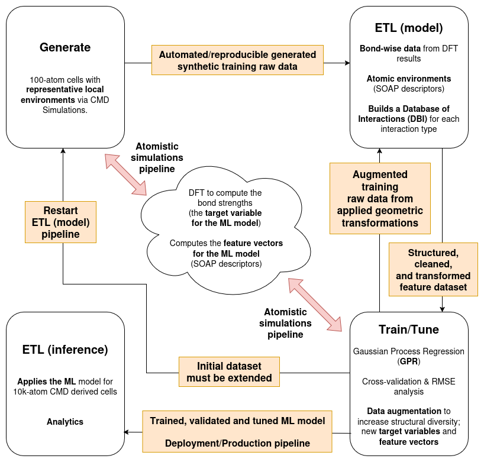

# PRM_4_113603 :: scripts

Below is an illustration of the MLOps workflow in terms of the Generate+ETL (GETL) framework used in **Phys. Rev. Materials 4, 113603** (DOI: https://doi.org/10.1103/PhysRevMaterials.4.113603; or the [preprint](https://www.researchgate.net/publication/345634787_Chemical_bonding_in_metallic_glasses_from_machine_learning_and_crystal_orbital_Hamilton_population)):

Below a description of the directories in this folder in the order they are used in the MLOps workflow depicted in the diagram above:

## Generate (DataOps phase; exploration/exploitation)

The original folder structure of the **raw data sources** generated using classical molecular dynamics (CMD) simulations is:

`ML/big-data-full/<NC>/c/md/lammps/100/<ID_RUN>/2000/<SUB_RUN>/`; with:

- `<NC>`: a nominal composition (NC) of the metallic glass. Almost all files in the folder 🗂️ [**data_examples**](https://github.com/aryrfjr/PRM_4_113603/tree/main/data_examples) are for the NC Zr₄₉Cu₄₉Al₂.
  
- `<ID_RUN>`: an independent CMD simulation configured to start with a random distribution of 100 atoms in a cubic cell. Almost all files in the folder 🗂️ [**data_examples**](https://github.com/aryrfjr/PRM_4_113603/tree/main/data_examples) are for run **21** of the NC Zr₄₉Cu₄₉Al₂.
  
  - 📝 **NOTE**: The goal here is to allow efficient **exploration** of the configurational space, when the current data coverage isn't enough; it adds new independent structures.

- `<SUB_RUN>`: an execution of the DFT simulations for the corresponding 100-atom cell generated with the CMD simulation (the reference structure for a specific `<ID_RUN>`). The structure used in sub-run **0** is exactly the same reference structure, whereas the remaining sub-runs (from **1** to **14**) are those derived from geometric transformations (shear, tension, compression) applied to the reference structure for **data augmentation**.

  - 📝 **NOTE**: The goal here is to allow efficient **exploitation** of the configurational space, when the structural diversity of current configs needs improvement without running a new CMD simulation.

Next, a description of each script in the **Generate** step:

- 📄 [**G/ML/big-data-full/zca-bd-full-SD-cpu.sh**](https://github.com/aryrfjr/PRM_4_113603/blob/main/scripts/G/ML/big-data-full/zca-bd-full-SD-cpu.sh): this script has no input files and it creates the run (`<ID_RUN>`) directories. For each `<ID_RUN>`, the script also creates the input file for the CMD simulation using LAMMPS and then runs it. The outputs of that simulation are written to that same `<ID_RUN>` directory. The full set of files generated is:
  
  - 💾 [**Zr49Cu49Al2.lmp.inp**](https://github.com/aryrfjr/PRM_4_113603/blob/main/data_examples/G/ML/big-data-full/Zr49Cu49Al2/c/md/lammps/100/21/Zr49Cu49Al2.lmp.inp): LAMMPS input file with 100-atom cells and instruction to generate random atomic coordinates when the CMD simulation starts.
  
  - 💾 [**Zr49Cu49Al2.lmp.out**](https://github.com/aryrfjr/PRM_4_113603/blob/main/data_examples/G/ML/big-data-full/Zr49Cu49Al2/c/md/lammps/100/21/Zr49Cu49Al2.lmp.out): generated by LAMMPS.
    
  - 💾 [**log.lammps**](https://github.com/aryrfjr/PRM_4_113603/blob/main/data_examples/G/ML/big-data-full/Zr49Cu49Al2/c/md/lammps/100/21/log.lammps): generated by LAMMPS.
 
  - 💾 [**zca-th300.dump**](https://github.com/aryrfjr/PRM_4_113603/blob/main/data_examples/G/ML/big-data-full/Zr49Cu49Al2/c/md/lammps/100/21/zca-th300.dump): generated by LAMMPS.
 
  - 💾 [**ZrCuAl-2011.lammps.eam**](https://github.com/aryrfjr/PRM_4_113603/blob/main/atomistic_models/ML/big-data-full/ZrCuAl-2011.lammps.eam): copied by LAMMPS from the path in the folder 🗂️ [**atomistic_models**](https://github.com/aryrfjr/PRM_4_113603/tree/main/atomistic_models).

- 📄 [**G/ML/big-data-full/scripts/setup_ICOHP_jobs.py**](https://github.com/aryrfjr/PRM_4_113603/blob/main/scripts/G/ML/big-data-full/scripts/setup_ICOHP_jobs.py): this script reads the output 📥 [**zca-th300.dump**](https://github.com/aryrfjr/PRM_4_113603/blob/main/data_examples/G/ML/big-data-full/Zr49Cu49Al2/c/md/lammps/100/21/zca-th300.dump) above and:

   - Creates the directories from **0** to **14** for each `<SUB_RUN>` with:
 
     - 💾 [**Zr49Cu49Al2.scf.in**](https://github.com/aryrfjr/PRM_4_113603/blob/main/data_examples/G/ML/big-data-full/Zr49Cu49Al2/c/md/lammps/100/21/2000/0/Zr49Cu49Al2.scf.in): Quantum ESPRESSO (QE) input file for the ground state electronic structure simulation with DFT.
    
     - 💾 [**Zr49Cu49Al2-check.scf.in**](https://github.com/aryrfjr/PRM_4_113603/blob/main/data_examples/G/ML/big-data-full/Zr49Cu49Al2/c/md/lammps/100/21/2000/0/Zr49Cu49Al2-check.scf.in): same content of 💾 [**Zr49Cu49Al2.scf.in**](https://github.com/aryrfjr/PRM_4_113603/blob/main/data_examples/G/ML/big-data-full/Zr49Cu49Al2/c/md/lammps/100/21/2000/0/Zr49Cu49Al2.scf.in), but it was used just to test a specific input variable of QE.
    
     - 💾 [**Zr49Cu49Al2.xyz**](https://github.com/aryrfjr/PRM_4_113603/blob/main/data_examples/G/ML/big-data-full/Zr49Cu49Al2/c/md/lammps/100/21/2000/0/Zr49Cu49Al2.xyz): just the same atomic positions and cell vectors from the loaded file 📥 [**zca-th300.dump**](https://github.com/aryrfjr/PRM_4_113603/blob/main/data_examples/G/ML/big-data-full/Zr49Cu49Al2/c/md/lammps/100/21/zca-th300.dump) above if `<SUB_RUN>` is **0** (the reference structure). If `<SUB_RUN>` is between **1** to **14**, then the file contains one of those structures derived from geometric transformations (shear, tension, compression) applied to the reference structure for **data augmentation**.
    
     - 💾 [**lobsterin**](https://github.com/aryrfjr/PRM_4_113603/blob/main/data_examples/G/ML/big-data-full/Zr49Cu49Al2/c/md/lammps/100/21/2000/0/lobsterin): a LOBSTER input file with automatic detection of bonds.
    
     - 💾 [**lobsterin-quippy**](https://github.com/aryrfjr/PRM_4_113603/blob/main/data_examples/G/ML/big-data-full/Zr49Cu49Al2/c/md/lammps/100/21/2000/0/lobsterin-quippy): a LOBSTER input file with pre-fixed definition of bonds.

   - Uses QUIP for **feature engineering** by computing the **feature vectors** for the ML model (SOAP descriptors) for each `<SUB_RUN>` and saves as:
 
     - 💾 [**SOAPS.vec**](https://github.com/aryrfjr/PRM_4_113603/blob/main/data_examples/G/ML/big-data-full/Zr49Cu49Al2-SOAPS/c/md/lammps/100/21/2000/0/SOAPS.vec): a file with the per-atom SOAPs and the respective central atoms indexes.
    
       - ⚠️ **NOTE**: Actually, this is **Extract** not not **Generate**, and the result is saved in `ML/big-data-full/<NC>-SOAPS/c/md/lammps/100/<ID_RUN>/2000/<SUB_RUN>/`.
    
- 📄 [**G/ML/big-data-full/zca-QE-SD_cpu.sh**](https://github.com/aryrfjr/PRM_4_113603/blob/main/scripts/G/ML/big-data-full/zca-QE-SD_cpu.sh): this script simply runs QE, what will result in the following files for each `<SUB_RUN>`:

  - 💾 [**Zr49Cu49Al2.scf.out**](https://github.com/aryrfjr/PRM_4_113603/blob/main/data_examples/G/ML/big-data-full/Zr49Cu49Al2/c/md/lammps/100/21/2000/0/Zr49Cu49Al2.scf.out): generated by QE.
 
  - 💾 **QE_run**: the file is empty according to the script and it is used as a flag in next steps.
 
- 📄 [**G/ML/big-data-full/zca-LOB-SD_cpu.sh**](https://github.com/aryrfjr/PRM_4_113603/blob/main/scripts/G/ML/big-data-full/zca-LOB-SD_cpu.sh): this script simply runs LOBSTER, what will result in the following files for each `<SUB_RUN>`:

  - 💾 [**Zr49Cu49Al2.lb.out**](https://github.com/aryrfjr/PRM_4_113603/blob/main/data_examples/G/ML/big-data-full/Zr49Cu49Al2/c/md/lammps/100/21/2000/0/Zr49Cu49Al2.lb.out): generated by LOBSTER.
 
  - 💾 [**lobsterout**](https://github.com/aryrfjr/PRM_4_113603/blob/main/data_examples/G/ML/big-data-full/Zr49Cu49Al2/c/md/lammps/100/21/2000/0/lobsterout): generated by LOBSTER and contains some information of the run. This file is not used by the ML model.
 
  - 💾 [**ICOHPLIST.lobster**](https://github.com/aryrfjr/PRM_4_113603/blob/main/data_examples/G/ML/big-data-full/Zr49Cu49Al2/c/md/lammps/100/21/2000/0/ICOHPLIST.lobster): generated by LOBSTER and it contains the -ICOHP values (the **supervised labels**; **labeling strategy**) used to train the ML model.
 
  - 💾 [**LOB_run**](https://github.com/aryrfjr/PRM_4_113603/blob/main/data_examples/G/ML/big-data-full/Zr49Cu49Al2/c/md/lammps/100/21/2000/0/LOB_run): the file contains the `<SUB_RUN>` according to the script and it is used as a flag in next steps.

## ETL model (DataOps phase; Feature Store Lite)

At this point the **Generate** is finished and the **ETL model** starts. We have **automated/reproducible generated raw data** from atomistic simulations with DFT (the **bond strengths**; the **target variable** for the ML model) and **feature engineering** generated with QUIP (the SOAP descriptors; the **feature vectors** for the ML model). The next step will be the execution of the following script:

- 📄 [**ETL_model/ML/big-data-full/scripts/create_SSDB.py**](https://github.com/aryrfjr/PRM_4_113603/blob/main/scripts/ETL_model/ML/big-data-full/scripts/create_SSDB.py): when executed in **per-bond** database mode (PB) for a given NC it will:

  - read from all `<ID_RUN>` and `<SUB_RUN>` folders the files:
 
    - 📥 [**SOAPS.vec**](https://github.com/aryrfjr/PRM_4_113603/blob/main/data_examples/G/ML/big-data-full/Zr49Cu49Al2-SOAPS/c/md/lammps/100/21/2000/0/SOAPS.vec): to load the 100-atom cells SOAP descriptors.
   
    - 📥 [**Zr49Cu49Al2.scf.out**](https://github.com/aryrfjr/PRM_4_113603/blob/main/data_examples/G/ML/big-data-full/Zr49Cu49Al2/c/md/lammps/100/21/2000/0/Zr49Cu49Al2.scf.out): just to check if the QE electronic structure calculation has converged.
   
    - 📥 [**Zr49Cu49Al2.lb.out**](https://github.com/aryrfjr/PRM_4_113603/blob/main/data_examples/G/ML/big-data-full/Zr49Cu49Al2/c/md/lammps/100/21/2000/0/Zr49Cu49Al2.lb.out): just to check if the LOBSTER calculation has been finished successfully.
   
    - 📥 [**ICOHPLIST.lobster**](https://github.com/aryrfjr/PRM_4_113603/blob/main/data_examples/G/ML/big-data-full/Zr49Cu49Al2/c/md/lammps/100/21/2000/0/ICOHPLIST.lobster): to load the **bond strengths**.
   
  - write to a **per-bond single SOAP database** (PBSSDB) directory `ML/big-data-full/<NC>-PBSSDB` files for all possible **bond-types SA-SB** (with **SA/SB** as Zr, Al, Cu):
 
    - 💾 [**SA-SB.bnd**](https://github.com/aryrfjr/PRM_4_113603/blob/main/data_examples/ETL_model/ML/big-data-full/Zr49Cu49Al2-PBSSDB/Al-Al.bnd): the result of the **labeling process**, with bonds distances and -ICOHP values (**supervised labels**). This output file header structure is composed by the columns **ID_RUN**, **SUB_RUN**, **ATOMA_IDX**, **ATOMB_IDX**, **BOND_DISTANCE**, and **BOND_ICOHP**.
   
    - 💾 [**SA-SB-SOAPS.vec**](https://github.com/aryrfjr/PRM_4_113603/blob/main/data_examples/ETL_model/ML/big-data-full/Zr49Cu49Al2-PBSSDB/Al-Al-SOAPS.vec): the SOAP vectors for atoms in bonds (the additional **feature input**).
   
    - 💾 [**DUB.info**](https://github.com/aryrfjr/PRM_4_113603/blob/main/data_examples/ETL_model/ML/big-data-full/Zr49Cu49Al2-PBSSDB/DUB.info): an information file with those bonds detected by LOBSTER and by QUIP are not compatible. This output file header structure is composed by the columns **ID_RUN**, **SUB_RUN**, and **bond**.
   
    - 💾 [**ND.info**](https://github.com/aryrfjr/PRM_4_113603/blob/main/data_examples/ETL_model/ML/big-data-full/Zr49Cu49Al2-PBSSDB/ND.info): an information file with those sub-runs (**SUB_RUN**) whose statuses are different from **DONE** or **SCF_CONVERGED_LOB_NOT_FINISHED_BUT_ICOHP_OK**. This output file header structure is composed by the columns **ID_RUN**, **SUB_RUN**, and **status**.

The goal of the next step is to bring **transferability** and **model generalization** by mixing the per-NC databases. That process would be equivalent to a **feature store curation** or **training data registry**; a core asset in scalable MLOps. This is done with the following script:

- 📄 [**ETL_model/ML/big-data-full/scripts/mix_SSDBs.py**](https://github.com/aryrfjr/PRM_4_113603/blob/main/scripts/ETL_model/ML/big-data-full/scripts/mix_SSDBs.py): this script creates **per-bond type** (two types of atoms **SA-SB**; with **SA/SB** as Zr, Al, Cu) **mixed databases** for a set of NCs with a specific number of bonds (the **training set size** in **Fig. 1** of **Phys. Rev. Materials 4, 113603**). When executed the script will:

  - read from the PBSSDB directories of the selected NCs (`ML/big-data-full/<NC>-PBSSDB`):
 
    - 📥 [**SA-SB.bnd**](https://github.com/aryrfjr/PRM_4_113603/blob/main/data_examples/ETL_model/ML/big-data-full/Zr49Cu49Al2-PBSSDB/Al-Al.bnd): the result of the **labeling process**, with bonds distances and -ICOHP values (**supervised labels**). This output file header structure is composed by the columns **ID_RUN**, **SUB_RUN**, **ATOMA_IDX**, **ATOMB_IDX**, **BOND_DISTANCE**, and **BOND_ICOHP**
   
    - 📥 [**SA-SB-SOAPS.vec**](https://github.com/aryrfjr/PRM_4_113603/blob/main/data_examples/ETL_model/ML/big-data-full/Zr49Cu49Al2-PBSSDB/Al-Al-SOAPS.vec): the SOAP vectors for atoms in bonds (the additional **feature input**).
   
  - write the **mixed database** (for instance named as [**DB8**](https://github.com/aryrfjr/PRM_4_113603/tree/main/data_examples/ETL_model/ML/big-data-full/DB8)):
 
    - 💾 [**DB8_SA-SB.info**](https://github.com/aryrfjr/PRM_4_113603/blob/main/data_examples/ETL_model/ML/big-data-full/DB8/DB8_Al-Al.info): an information file with the **mixed database** name, its **bond type**, and the number of bonds from each NC.
   
    - 💾 [**DB8_SA-SB.bnd**](https://github.com/aryrfjr/PRM_4_113603/blob/main/data_examples/ETL_model/ML/big-data-full/DB8/DB8_Al-Al.bnd): a file with the same structure of the per-NC file 📥 [**SA-SB.bnd**](https://github.com/aryrfjr/PRM_4_113603/blob/main/data_examples/ETL_model/ML/big-data-full/Zr49Cu49Al2-PBSSDB/Al-Al.bnd) from which a set of lines are randomly selected.
   
    - 💾 [**DB8_SA-SB-SOAPS.vec**](https://github.com/aryrfjr/PRM_4_113603/blob/main/data_examples/ETL_model/ML/big-data-full/DB8/DB8_Al-Al-SOAPS.vec): a file with the same structure of the per-NC file 📥 [**SA-SB-SOAPS.vec**](https://github.com/aryrfjr/PRM_4_113603/blob/main/data_examples/ETL_model/ML/big-data-full/Zr49Cu49Al2-PBSSDB/Al-Al-SOAPS.vec) from which the corresponding random lines selected for 💾 [**DB8_SA-SB.bnd**](https://github.com/aryrfjr/PRM_4_113603/blob/main/data_examples/ETL_model/ML/big-data-full/DB8/DB8_Al-Al.bnd) are picked.

    - 📝 **NOTE**: In the end, what has been implemented was a **Feature Store Lite**, where each output DBI is the **structured** and **versioned input** to the ML model. 

## Train/Tune (ModelOps phase; observability or model evaluation)

- 📄 [**TT/ML/big-data-full/scripts/PBSSDB-kernel_fit.py**](https://github.com/aryrfjr/PRM_4_113603/blob/main/scripts/TT/ML/big-data-full/scripts/PBSSDB-kernel_fit.py): this script will load both the **training set** and the **testing set** from one or more PBSSDB directories. It can perform a cross-validation in which the training and the testing sets come from different databases or load both sets from a single database. The script will:

  - read from one or more PBSSDB directories:
 
    - 📥 [**SA-SB.bnd**](https://github.com/aryrfjr/PRM_4_113603/blob/main/data_examples/ETL_model/ML/big-data-full/Zr49Cu49Al2-PBSSDB/Al-Al.bnd): the result of the **labeling process**, with bonds distances and -ICOHP values (**supervised labels**). This output file header structure is composed by the columns **ID_RUN**, **SUB_RUN**, **ATOMA_IDX**, **ATOMB_IDX**, **BOND_DISTANCE**, and **BOND_ICOHP**
   
    - 📥 [**SA-SB-SOAPS.vec**](https://github.com/aryrfjr/PRM_4_113603/blob/main/data_examples/ETL_model/ML/big-data-full/Zr49Cu49Al2-PBSSDB/Al-Al-SOAPS.vec): the SOAP vectors for atoms in bonds (the additional **feature input**).
   
  - if, for instance, the scripts runs with the NC set to **Zr49Cu49Al2**, the **interaction type** set to **Zr-Cu**, the **kernel dimension** set to **2000**, the **zeta hyperparameter** set to **1.0**, the **sigma hyperparameter** set to **1.0**, the **additional hyperparameter** (see **Phys. Rev. Materials 4, 113603**) set to **0.04**, and the **training set** size set to **1000**, the following files will be generated:
 
    - 💾 [**Zr49Cu49Al2-Zr-Cu-2000-1.0-1.0-0.04-1000.dat**](https://github.com/aryrfjr/PRM_4_113603/blob/main/data_examples/TT/ML/big-data-full/scripts/Zr49Cu49Al2_ultimate/Zr49Cu49Al2-Zr-Cu-2000-1.0-1.0-0.04-1000.dat): a two columns file with the predicted -ICOHP value from the ML model versus the actual value from DFT electronic structure simulation.
   
    - 💾 [**Zr49Cu49Al2-Zr-Cu-2000-1.0-1.0-0.04-1000.info**](https://github.com/aryrfjr/PRM_4_113603/blob/main/data_examples/TT/ML/big-data-full/scripts/Zr49Cu49Al2_ultimate/Zr49Cu49Al2-Zr-Cu-2000-1.0-1.0-0.04-1000.info): the same content of the **.dat** file described above but with two additional columns with the indexes of the interaction in the database. And in the last four lines of the file also brings the Root Mean Square Error (RMSE) value, plus the associated variances and standard deviations for both **training** and **testing sets**.
   
    - 💾 [**Zr49Cu49Al2-Zr-Cu-2000-1.0-1.0-0.04-1000.png**](https://github.com/aryrfjr/PRM_4_113603/blob/main/data_examples/TT/ML/big-data-full/scripts/Zr49Cu49Al2_ultimate/Zr49Cu49Al2-Zr-Cu-2000-1.0-1.0-0.04-1000.png): a **.png** file is generated using 📦 **matplotlib.pyplot** with all the information in the **.dat** file described above.
   
      - 📈 The example of **.png** file described above is: 
 
- 📄 [**TT/SS-ML/scripts/ML-ICOHP_RMSD.py**](https://github.com/aryrfjr/PRM_4_113603/blob/main/scripts/TT/SS-ML/scripts/ML-ICOHP_RMSD.py): this script will perform validation in the same scenario of **Production**. The **training set** is loaded from a **mixed database**, whereas the **testing set** is loaded from a 100-atom cell of a specific NC (Zr₄₅Cu₄₅Al₁₀ in the file examples below; with **ID_RUN** set to **1**) for which we have the **target -ICOHP values** (calculated with DFT). The script will:

  - read the **mixed database** (for instance named as [**DB4**](https://github.com/aryrfjr/PRM_4_113603/tree/main/data_examples/ETL_model/ML/big-data-full/DB4)) generated with the script 📄 [**ETL_model/ML/big-data-full/scripts/mix_SSDBs.py**](https://github.com/aryrfjr/PRM_4_113603/blob/main/scripts/ETL_model/ML/big-data-full/scripts/mix_SSDBs.py) as per description above, whose files to be loaded are:

    - 📥 [**DB4_SA-SB.info**](https://github.com/aryrfjr/PRM_4_113603/blob/main/data_examples/ETL_model/ML/big-data-full/DB4/DB4_Al-Al.info): an information file with the **mixed database** name, its **bond type**, and the number of bonds from each NC.
   
    - 📥 [**DB4_SA-SB.bnd**](https://github.com/aryrfjr/PRM_4_113603/blob/main/data_examples/ETL_model/ML/big-data-full/DB4/DB4_Al-Al.bnd): a file with bonds distances and -ICOHP values (**supervised labels**) generated by the script.
   
    - 📥 [**DB4_SA-SB-SOAPS.vec**](https://github.com/aryrfjr/PRM_4_113603/blob/main/data_examples/ETL_model/ML/big-data-full/DB4/DB4_Al-Al-SOAPS.vec): a file with the SOAP vectors for atoms in bonds (the additional **feature input**).
   
  - and then read some additional files:
   
    - 📥 [**zca-th300.dump**](https://github.com/aryrfjr/PRM_4_113603/blob/main/data_examples/G/ML/big-data-full/Zr45Cu45Al10/c/md/lammps/100/1/zca-th300.dump): if the script runs with the `<SUB_RUN>` argument set to **0**, then last time step in this file is read. This file was generated by LAMMPS and contains atomic positions and cell vectors of each time step of the CMD simulation.

    - 📥 [**Zr45Cu45Al10.xyz**](https://github.com/aryrfjr/PRM_4_113603/blob/main/data_examples/G/ML/big-data-full/Zr45Cu45Al10/c/md/lammps/100/1/2000/1/Zr45Cu45Al10.xyz): if the script runs with the `<SUB_RUN>` argument set to a number between **1** to **14**, then this file is read; and it will contain one of those structures derived from geometric transformations (shear, tension, compression) applied to the reference structure for **data augmentation**. This file was created by the script 📄 [**G/ML/big-data-full/scripts/setup_ICOHP_jobs.py**](https://github.com/aryrfjr/PRM_4_113603/blob/main/scripts/G/ML/big-data-full/scripts/setup_ICOHP_jobs.py) in the **Generate** step.

    - 📥 [**ICOHPLIST.lobster**](https://github.com/aryrfjr/PRM_4_113603/blob/main/data_examples/G/ML/big-data-full/Zr45Cu45Al10/c/md/lammps/100/1/2000/0/ICOHPLIST.lobster): this is a file with the -ICOHP values calculated with DFT in the **Generate** step, created when the script 📄 [**G/ML/big-data-full/zca-LOB-SD_cpu.sh**](https://github.com/aryrfjr/PRM_4_113603/blob/main/scripts/G/ML/big-data-full/zca-LOB-SD_cpu.sh) was executed.
   
  - to write:
 
    - 💾 [**last.xyz**](https://github.com/aryrfjr/PRM_4_113603/blob/main/data_examples/G/ML/big-data-full/Zr45Cu45Al10/c/md/lammps/100/1/last.xyz): if the script runs with the `<SUB_RUN>` argument set to **0**, then last time step read from file 📥 [**zca-th300.dump**](https://github.com/aryrfjr/PRM_4_113603/blob/main/data_examples/G/ML/big-data-full/Zr45Cu45Al10/c/md/lammps/100/1/zca-th300.dump) will be written to this file; which is saved in the same `<SUB_RUN>` directory. This file is used for the computation of SOAP descriptors.
   
    - 💾 [**out**](https://github.com/aryrfjr/PRM_4_113603/blob/main/data_examples/TT/ML/big-data-full/scripts/toGS/out): all the remaining output of this script goes to the console (standard output); and this is the file crated when the standard output (stdout) was redirected.
   
    - 💾 [**SA-SB.png**](https://github.com/aryrfjr/PRM_4_113603/blob/main/data_examples/TT/ML/big-data-full/scripts/toGS/Zr-Zr.png): a **.png** file is generated using 📦 **matplotlib.pyplot** for all possible **bond-types SA-SB** (with **SA/SB** as Zr, Al, Cu).
   
      - 📈 The example of **.png** file described above is: 
   
## ETL inference (after Deployment/Production)

- 📄 [**ETL_inference/SS-ML/scripts/ML-ICOHP.py**](https://github.com/aryrfjr/PRM_4_113603/blob/main/scripts/ETL_inference/SS-ML/scripts/ML-ICOHP.py): this script will load a set of steps from a LAMMPS .dump file to compute the ML predicted -ICOHP values for all detected bonds. It uses a production **mixed database** to infer bond strengths on large-scale (e.g. 10k-atom) metallic glasses structures, whose atomic level whole structure is more realistic. The script will:

  - read the **mixed database** (for instance named as [**DB8**](https://github.com/aryrfjr/PRM_4_113603/tree/main/data_examples/ETL_model/ML/big-data-full/DB8)) generated with the script 📄 [**ETL_model/ML/big-data-full/scripts/mix_SSDBs.py**](https://github.com/aryrfjr/PRM_4_113603/blob/main/scripts/ETL_model/ML/big-data-full/scripts/mix_SSDBs.py) as per description above, whose files to be loaded are:

    - 📥 [**DB8_SA-SB.info**](https://github.com/aryrfjr/PRM_4_113603/blob/main/data_examples/ETL_model/ML/big-data-full/DB8/DB8_Al-Al.info): an information file with the **mixed database** name, its **bond type**, and the number of bonds from each NC.
   
    - 📥 [**DB8_SA-SB.bnd**](https://github.com/aryrfjr/PRM_4_113603/blob/main/data_examples/ETL_model/ML/big-data-full/DB8/DB8_Al-Al.bnd): a file with bonds distances and -ICOHP values (**supervised labels**) generated by the script.
   
    - 📥 [**DB8_SA-SB-SOAPS.vec**](https://github.com/aryrfjr/PRM_4_113603/blob/main/data_examples/ETL_model/ML/big-data-full/DB8/DB8_Al-Al-SOAPS.vec): a file with the SOAP vectors for atoms in bonds (the additional **feature input**).

  - and then read an additional file:

    - 📥 [**zca-dspa.dump**](https://github.com/aryrfjr/PRM_4_113603/blob/main/data_examples/ETL_inference/SS-ML/Zr49Cu49Al2/c/md/lammps/ultimate/2/): the file generated by LAMMPS which contains atomic positions and cell vectors of each time step of the CMD simulation for the more realistic 10k-atom cell.

  - to finally write the result of the ML model for each **ITEM** (a specific structure in the sequence of dumped steps in the CMD simulation) and corresponding **TIMESTEP** (the timestep ID in the CMD simulation):
 
    - 💾 [**ITEM_TIMESTEP_ICOHPLIST.info**](https://github.com/aryrfjr/PRM_4_113603/blob/main/data_examples/ETL_inference/SS-ML/Zr49Cu49Al2/c/md/lammps/ultimate/2/icohps/1_0_ICOHPLIST.info): an information file with the number of interactions (detected bonds) and the results and parameters for the simulation for each one of the **bond-types SA-SB** (with **SA/SB** as Zr, Al, Cu).

    - 💾 [**ITEM_TIMESTEP_ICOHPLIST.lobster**](https://github.com/aryrfjr/PRM_4_113603/blob/main/data_examples/ETL_inference/SS-ML/Zr49Cu49Al2/c/md/lammps/ultimate/2/icohps/1_0_ICOHPLIST.lobster): an output file with the same structure of the LOBSTER output that is created when the script 📄 [**G/ML/big-data-full/zca-LOB-SD_cpu.sh**](https://github.com/aryrfjr/PRM_4_113603/blob/main/scripts/G/ML/big-data-full/zca-LOB-SD_cpu.sh) is executed.
